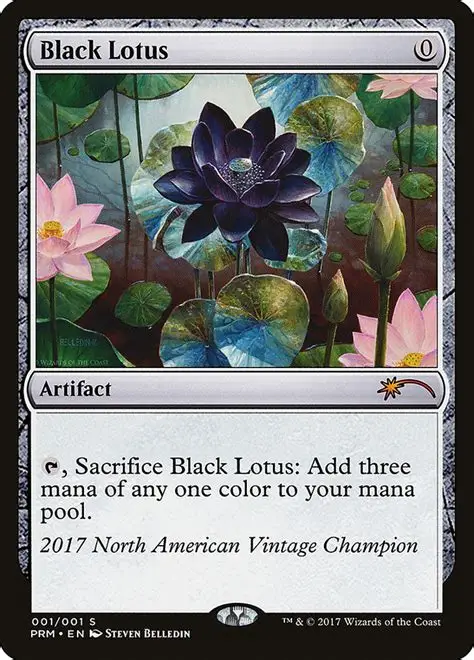
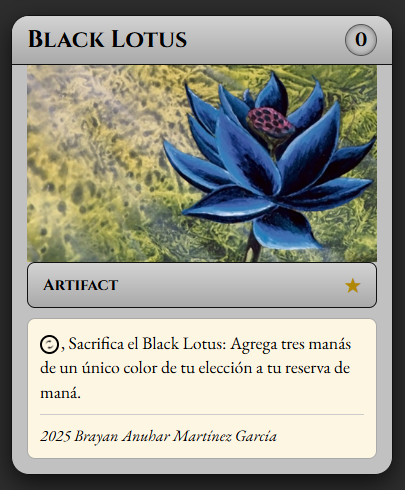

# 📌 Práctica Trading Cards

## 👤 Información del estudiante

- Nombre: Brayan Anuhar Martínez García
- Matrícula: S22017044
- Fecha: 25/09/2025

## 📝 Descripción
La tarjeta está inspirada en la icónica carta "Black Lotus" del juego Magic: The Gathering. El objetivo fue replicar su diseño característico y, al mismo tiempo, aplicar buenas prácticas de desarrollo front-end.
[**Ver resultado**](https://brayanmtzzz.github.io/practica-1-trading-cards-brayanmtzzz/)

## Inspiración

## ✅ Resultado

